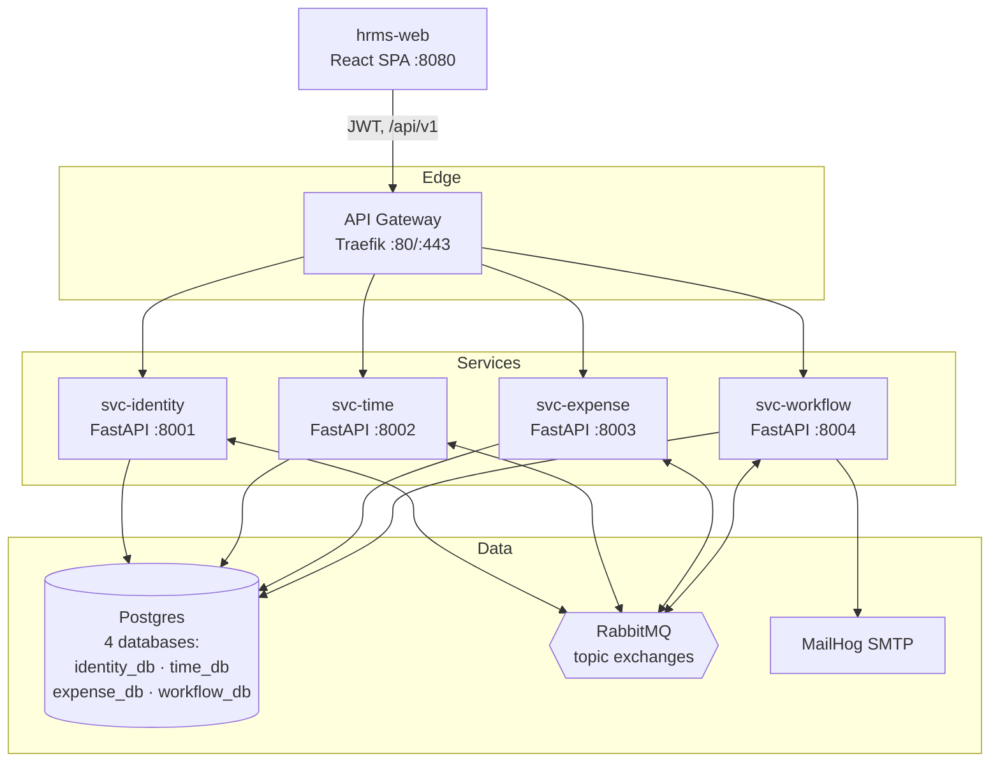
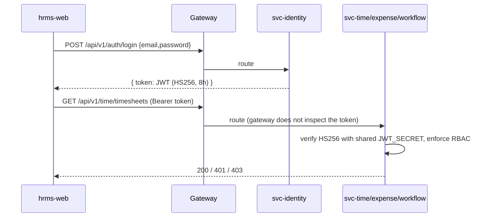

# Atlas HRMS — Architecture & Engineering Standards

> Single source of truth for cross-cutting behavior. Every per-repo spec references this document instead of restating it. Where a per-repo doc disagrees with this file, **this file wins**.

- **Baseline:** `v1.1` (2026-09-06) — *deliberate-simplicity pass*
- **Companion docs:** [`PROJECT_OVERVIEW.md`](./PROJECT_OVERVIEW.md), [`SCENARIOS.md`](./SCENARIOS.md)

---

## 0. Design charter — what this project optimizes for

Atlas exists to teach **how one feature moves across many repos in an enterprise**. It is *not* a production HRMS and not a place to demonstrate deep per-service infrastructure. Every choice below optimizes for **simple to implement, simple to maintain, easy to run and see** — while keeping the *enterprise shape* that carries the lesson: many repos, independent deploys, contracts as the coordination unit, a gateway, and events between services.

**In scope (the lesson):** polyrepo layout · contract-first (OpenAPI + event schemas) · API gateway routing · domain events over a broker · read models · deploy ordering · the five cross-repo scenarios · one-command local run with visible state.

**Deliberately out of scope (production hardening — kept as one-line "prod note"s, never built):** transactional outbox & relay workers · dead-letter/retry topologies · RS256/JWKS/ForwardAuth/refresh-token rotation/service-to-service OAuth · OpenTelemetry/Jaeger/Prometheus/Grafana · Kubernetes/Helm as a build deliverable · object storage for receipts · per-service database *servers*.

**Simplicity rules of thumb:** each backend service is a **thin CRUD + emit/consume** app (a few hundred lines); if a feature needs deep intra-service machinery to demonstrate, it does not belong here; when in doubt, prefer the boring option that a reader can hold in their head.

## 1. Container diagram (C4 Level 2)



**One Postgres server, four databases.** Database-per-service stays a hard *rule* — a service only ever opens its own `DATABASE_URL` and never another database — but a single container hosts all four (see §6 for how the boundary is enforced). Four fewer moving parts to run, same boundary lesson.

**Ports (local):** gateway host `8080` (`/`→web, `/api`→gateway), identity `8001`, time `8002`, expense `8003`, workflow `8004`, Postgres `5432`, RabbitMQ `5672`/mgmt UI `15672`, Adminer (DB browser) `8081`, MailHog SMTP `1025`/UI `8025`.

## 2. Service responsibility matrix

| Capability | Owner | Never owned by |
|---|---|---|
| Employee record, org hierarchy, cost center | `svc-identity` | anyone else (others hold read models) |
| JWT issuance (login) & RBAC roles | `svc-identity` | — |
| Timesheets, clock in/out, overtime calc | `svc-time` | — |
| PTO/leave requests, accrual balances | `svc-time` | — |
| Expense reports, line items, receipts | `svc-expense` | — |
| Currency, FX conversion, reimbursement | `svc-expense` | — |
| Approval routing & state machine | `svc-workflow` | — |
| Policy evaluation (limits, thresholds) | `svc-workflow` | — |
| Notifications (email) | `svc-workflow` | — |
| Gateway routing | `platform-outerloop` | — |

**Rule:** a capability has exactly one owning service, with its own database. Cross-domain data is obtained via a **local read model** fed by events — **not** by synchronous service-to-service calls. Keeping the request path free of service-to-service calls is a deliberate simplification: it removes a whole class of auth, retry, and failure handling, and it makes the event-driven lesson (Scenarios 3 & 5) the *only* way cross-domain data flows. No service ever connects to another service's database.

## 3. Synchronous communication (REST)

- **Entry point:** all client traffic hits the gateway at `https://<host>/api/v1/...`. The gateway strips the prefix and routes by path to the owning service. Path ownership:
  - `/api/v1/identity/**`, `/api/v1/auth/**` → `svc-identity`
  - `/api/v1/time/**` → `svc-time`
  - `/api/v1/expense/**` → `svc-expense`
  - `/api/v1/workflow/**`, `/api/v1/approvals/**` → `svc-workflow`
- **No service-to-service sync calls.** Cross-domain reads use the local read model (see §2). This is intentional — it keeps every service's inbound surface to just "the gateway" and removes service-to-service auth entirely.
- **Versioning:** URI-versioned (`/api/v1`). A breaking change ships as `/api/v2` alongside `v1` — this is the coordination lesson, so it stays. (Deprecation/sunset headers are a one-line prod note, not required locally.)
- **Pagination:** simple page params — `?limit=50&offset=0`; response `{ "items": [...], "total": <int> }`. (Cursor pagination is a prod note; offset is enough to teach and trivial to implement.)
- **Health:** every service exposes `GET /healthz` (checks DB + broker) for compose healthchecks. Not client-routed.

*(Dropped from the earlier draft as incidental: `Idempotency-Key` storage, cursor pagination, deprecation headers. They are production niceties that add per-service machinery without teaching anything about multi-repo coordination.)*

### 3.1 Standard error envelope

Every non-2xx response body:

```json
{
  "error": {
    "code": "TIME_OVERLAPPING_ENTRY",
    "message": "A timesheet entry already exists for this date range.",
    "correlation_id": "b3c1f0e2-....",
    "details": [ { "field": "date", "issue": "overlaps entry 4412" } ]
  }
}
```

- `code` is a stable, UPPER_SNAKE, service-prefixed enum (documented per service). UIs branch on `code`, never on `message`.
- HTTP status usage: `400` validation, `401` missing/invalid token, `403` RBAC denial, `404` not found, `409` conflict/idempotency mismatch, `422` domain-rule violation, `429` rate limited, `503` dependency unavailable.

## 4. AuthN / AuthZ



Auth is kept deliberately minimal — enough for realistic RBAC-driven scenarios, none of the production key infrastructure.

- **One token, symmetric signing.** `svc-identity` issues a **JWT signed HS256** with a shared secret `JWT_SECRET` (in `.env`, same value for all services). Every service verifies the token in-process with a ~10-line shared dependency. No RS256, no JWKS, no refresh tokens (an 8-hour access token is fine locally; "re-login" is the refresh story).
- **Claims:** `sub` (employee_id), `roles` (array), `mgr` (manager id or null), `email`, `exp`, `iat`. That's it.
- **Gateway = pure routing.** Traefik only maps paths to services (no JWT plugin, no ForwardAuth). Each service does its own verify + RBAC — which is also the honest teaching model (authorization lives with the domain that owns the resource).
- **RBAC roles:** `EMPLOYEE`, `MANAGER`, `FINANCE`, `HR_ADMIN`. Enforced per service against claims + ownership (an employee reads only their own records unless they are that employee's `MANAGER` or hold a privileged role). These role differences are what make Scenarios 1, 2 and the Approvals queue meaningful, so RBAC stays.
- **Correlation ID:** each service reads `X-Correlation-Id` from the incoming request or mints one, and echoes it on the response, in logs, and on emitted events. No gateway plugin needed.

*Prod note (not built): edge JWT verification, RS256 + JWKS rotation, refresh-token rotation/revocation, and service-to-service tokens.*

## 5. Asynchronous communication (events)

- **Broker:** RabbitMQ, one **topic exchange per producing domain** (`identity.events`, `time.events`, `expense.events`, `workflow.events`). Consumers bind durable queues with routing keys.
- **Publishing (simple):** the producer **publishes the event right after its DB commit**, in the same request handler. No outbox, no relay worker. This is at-least-once *enough* for teaching; the tiny window where a crash between commit and publish could drop an event is called out as a prod note, not solved.
- **Idempotent consumers (simple):** handlers are written to be safe to run twice — an **upsert by natural key** (e.g. `employee_read` by `employee_id`, `approval` by `subject_id`). No dedupe table required.
- **Envelope (JSON):** small and flat.

```json
{
  "id": "uuid",              // unique event id
  "type": "employee.created",
  "source": "svc-identity",
  "time": "2026-09-06T10:00:00Z",
  "correlation_id": "b3c1...",
  "data": { "...": "..." }
}
```

- **Schema evolution:** additive-only within a major (new optional fields OK). A breaking payload change ships as a new `type` version and runs in parallel until consumers migrate — this *is* a core coordination lesson (Scenario 4), so it stays. Payload schemas live in the contract registry (§8).

*Prod note (not built): transactional outbox + relay for guaranteed delivery, and dead-letter/retry topologies.*

### 5.1 Event catalog

| Event `type` | Producer | Consumers | Purpose |
|---|---|---|---|
| `employee.created` | svc-identity | svc-time, svc-expense, svc-workflow | Provision read model + default profiles/accruals |
| `employee.updated` | svc-identity | svc-time, svc-expense, svc-workflow | Sync name/cost-center/manager changes |
| `employee.deactivated` | svc-identity | svc-time, svc-expense, svc-workflow | Disable submissions |
| `timesheet.submitted` | svc-time | svc-workflow | Trigger approval routing |
| `timesheet.approved` / `timesheet.rejected` | svc-workflow | svc-time | Finalize timesheet state |
| `expense.submitted` | svc-expense | svc-workflow | Trigger approval + policy check |
| `expense.approved` / `expense.rejected` | svc-workflow | svc-expense | Reimburse / return |

That is the whole catalog — three producers, the events that cross a repo boundary, nothing internal. (Earlier drafts added `approval.requested`, `notification.dispatched`, and `expense.reimbursed`; those stay *inside* a service or are just a DB update + a MailHog email, so they don't need to be broker events.) Payload fields: [`DATA_CONTRACTS.md §3`](./DATA_CONTRACTS.md#3-event-payloads-data-field-of-the-cloudevents-envelope).

### 5.2 Queues & bindings (kept minimal)

Each consuming service declares its own durable queues on startup (safe to re-declare). Naming: `<consumer>.<event-slug>`.

| Queue | Bound exchange | Routing key | Consumer | Purpose |
|---|---|---|---|---|
| `time.employee-events` | `identity.events` | `employee.*` | svc-time | read model + seed accruals (S5) |
| `expense.employee-events` | `identity.events` | `employee.*` | svc-expense | read model + profile (S5) |
| `workflow.employee-events` | `identity.events` | `employee.*` | svc-workflow | read model + default chain (S5) |
| `workflow.timesheet-submitted` | `time.events` | `timesheet.submitted` | svc-workflow | route timesheet approval |
| `workflow.expense-submitted` | `expense.events` | `expense.submitted` | svc-workflow | route + policy check |
| `time.decisions` | `workflow.events` | `timesheet.approved`,`timesheet.rejected` | svc-time | finalize timesheet |
| `expense.decisions` | `workflow.events` | `expense.approved`,`expense.rejected` | svc-expense | finalize / reimburse |

**On failure:** the handler logs the error and `nack`s the message back to the queue for a simple retry; a message that keeps failing is visible in the RabbitMQ UI (`:15672`) — which is the point, you can *see* it. No dead-letter/retry-queue machinery. Consumers stay idempotent via upsert, so redelivery is safe.

## 6. Data management

- **Database-per-service, one Postgres server.** Four databases (`identity_db`, `time_db`, `expense_db`, `workflow_db`) in a single Postgres 16 container. Locally the one `atlas` superuser backs all four; the boundary is enforced **by convention in code** — each service is configured with only its *own* `DATABASE_URL` and never references another database (no cross-database joins, no shared tables). *Prod note (not built): give each service its own DB role limited to its own database.*
- **Migrations:** Alembic per service. Every migration is **expand-only / backward compatible** with the running version (add nullable column → write both → backfill → require → drop old). This expand/contract discipline *is* the deploy-ordering lesson, so it stays.
- **Read models:** consuming services keep a slim `employee_read` table (id, display_name, cost_center, manager_id, home_currency, status) upserted from `employee.*` events. Never authoritative; rebuildable by replaying events. **This is the primary way cross-domain data moves — the whole point of Scenarios 3 & 5.**
- **Money:** integer minor units + ISO-4217 `currency`. No floats. FX conversion is `svc-expense`'s, using a small stored rate table seeded locally.
- **Receipts:** a plain `receipt_url` string on the expense line (paste-a-link). *Prod note (not built): object storage (S3/MinIO) with pre-signed uploads.*

## 7. Observability — just enough to *see* the flow

The teaching goal is "watch one action ripple across services," so observability is deliberately the cheap, high-value pieces:

- **Correlation ID** threaded through every request, log line, error envelope, and event — so you can follow one action across four services by grepping one id. This directly serves the multi-repo lesson and costs nothing.
- **Structured JSON logs** to stdout (`ts, level, service, correlation_id, msg`). Read them with `docker compose logs -f`.
- **The tools already give you the view:** RabbitMQ UI (queues/messages), Adminer (database rows), MailHog (emails). No collector to run.

*Prod note (not built, optional add-on): OpenTelemetry tracing + Jaeger, Prometheus metrics, Grafana dashboards. A `compose --profile observability` overlay may add them for the curious, but they are never required to run or understand Atlas.*

## 8. Contract registry (contract-first workflow)

`platform-outerloop/contracts/` is the **single registry**, but **producers own their contracts**:

```
contracts/
  openapi/
    identity.v1.yaml     # owned by svc-identity team
    time.v1.yaml         # owned by svc-time team
    expense.v1.yaml
    workflow.v1.yaml
  asyncapi/
    atlas-events.v1.yaml # union catalog; payload schemas below
  schemas/
    employee.created/1-0-0.json
    expense.submitted/1-0-0.json
    ...
```

Workflow: producer opens a PR to the registry changing its spec → CI runs backward-compat linting (`oasdiff`, `spectral`) → consumers are notified via CODEOWNERS → UI regenerates its typed client from `openapi/*.yaml`. **A contract change is a reviewable artifact, merged before implementation.**

## 9. Rollout / deploy ordering rules

Because repos deploy independently, ordering is dictated by dependency direction:

1. **Migrations first**, expand-only (never breaks the running version).
2. **Producers before consumers** for new/changed events (emit new field; consumers ignore until ready).
3. **Providers before clients** for REST (deploy the new endpoint/field, then the caller).
4. **UI last** — the SPA is the outermost client; ship it once its dependencies are live behind a feature flag if needed.
5. **Contract merged before any code** in every case.

This ordering is the assessable skill in [`SCENARIOS.md`](./SCENARIOS.md).

## 10. Technology versions

**Required stack (what you run):**

| Area | Choice | Version |
|---|---|---|
| Frontend runtime | Node / npm | 20.20.2 / 10.8.2 |
| Frontend framework | React / TypeScript / Vite | 18.3.1 / 5.4.5 / 5.4.21 |
| Frontend state/data | Redux Toolkit + RTK Query | 2.12.0 |
| UI kit | MUI | 5.18.0 |
| Backend language | Python | 3.12.14 |
| Web framework | FastAPI | 0.115.14 |
| ORM / migrations | SQLAlchemy / Alembic | 2.0.52 / 1.13.3 |
| Broker + client | RabbitMQ / aio-pika | 3.13.7 / 9.6.2 |
| Database | PostgreSQL (one server, 4 DBs) | 16.15 |
| Gateway | Traefik (routing only) | 3.7.13 |
| Local orchestration (tested host) | Docker / Docker Compose | 29.8.0 / 5.5.1 |
| DB browser (dev UI) | Adminer | 4.17.1 |
| Mail (dev) | MailHog | 1.0.1 |
| CI action | actions/checkout | 7.0.1 (full SHA pinned) |

**Not in the required stack (prod notes / optional):** Kubernetes + Helm, OpenTelemetry/Jaeger/Prometheus/Grafana, MinIO/S3. Docker-compose is the real, only-supported way to run Atlas. How it *would* map to Kubernetes is a short conceptual note in [`repos/platform-outerloop.md`](./repos/platform-outerloop.md), not a build deliverable.

The exact dependency and image-digest source of truth is
[`DEPENDENCY_BASELINE.md`](./DEPENDENCY_BASELINE.md). Changing a version is
itself a cross-repo coordination exercise.
