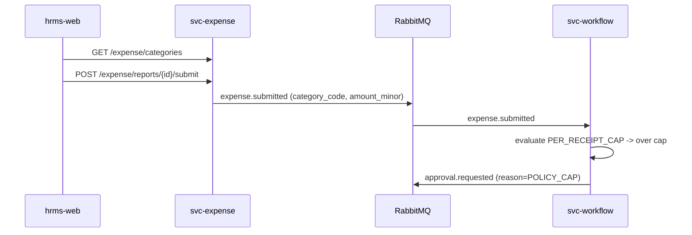
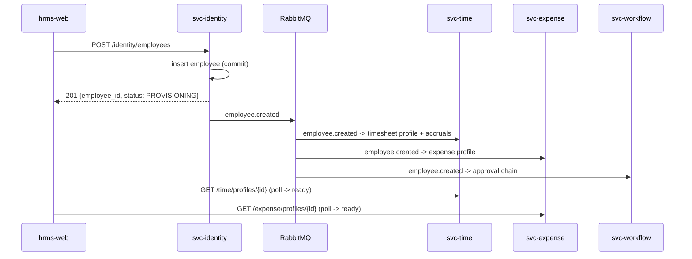

# Atlas HRMS — Cross-Repo Feature Scenarios

> The core teaching material. Each scenario is a real product change whose implementation **cannot fit in one repo**. The UI repo (`hrms-web`) is in **every** change set. For each scenario: the user story, the per-repo change table, the runtime sequence, the contract deltas, and the mandated **deploy order** (per [`ARCHITECTURE.md` §9](./ARCHITECTURE.md#9-rollout--deploy-ordering-rules)).

Repos: `hrms-web` (UI), `svc-identity`, `svc-time`, `svc-expense`, `svc-workflow`, `platform-outerloop`.

**How to use each scenario (learner loop):** read the story → predict the repos → find the contract that must change → order the rollout → implement → run `docker compose up --build -d` and verify end-to-end.

---

## Scenario 1 — New expense category with a policy cap

**User story:** *As a Finance admin, I want to add a "Client Entertainment" expense category with a €150/receipt cap, so that spend is controlled and over-cap line items are auto-flagged for manager approval.*

**Why it spans repos:** the category is domain data in Expense, the cap is a *policy* owned by Workflow, and the UI must offer the category and surface the cap violation. DevOps ships the migration/config path.

| Repo | Change | Contract impact |
|---|---|---|
| `svc-expense` | Add `category` reference data + validation; include `category_id` on line items; emit richer `expense.submitted` payload (adds `category_code`, `amount_minor`, `currency`). | `expense.v1.yaml`: new `GET /expense/categories`; `expense.submitted` schema `1-0-0 → 1-1-0` (additive). |
| `svc-workflow` | Add policy rule type `PER_RECEIPT_CAP`; evaluate on `expense.submitted`; if violated, route to manager approval and set `policy_flags`. | Consumes `expense.submitted` `1-1-0`; `approval.requested` gains `reason=POLICY_CAP`. |
| `hrms-web` | Category dropdown on the line-item form (from `GET /expense/categories`); show inline cap and a "will require approval" warning when exceeded. | Regenerate client from `expense.v1.yaml`. |
| `platform-outerloop` | Alembic migration job ordering; seed the new category + policy; no gateway route change. | Registry PR review; contract lint gate. |

**Runtime sequence:**

**Deploy order:** ① contract PR merged → ② `svc-expense` migration (add `category`, nullable `category_id`) → ③ `svc-expense` code emitting `1-1-0` → ④ `svc-workflow` consuming new fields + policy → ⑤ seed category+policy → ⑥ `hrms-web`. Old clients keep working because the payload change is additive and `category_id` starts nullable.

---

## Scenario 2 — Manager approval for overtime beyond a threshold

**User story:** *As an HR admin, I want any timesheet with more than 10 overtime hours in a week to require the employee's manager to approve it, so that overtime is controlled.*

**Why it spans repos:** overtime is computed in Time, the routing rule is Workflow, the manager relationship comes from Identity (already replicated), and the UI needs an approvals queue + status badges.

| Repo | Change | Contract impact |
|---|---|---|
| `svc-time` | Compute `overtime_hours` per timesheet; include it in `timesheet.submitted`. | `time.v1.yaml`: `timesheet` gains `overtime_hours`; `timesheet.submitted` `1-0-0 → 1-1-0`. |
| `svc-workflow` | Add routing rule `OVERTIME_THRESHOLD` (configurable hours); resolve approver = `mgr` claim/read model; emit `approval.requested` + notify. | Consumes `timesheet.submitted` `1-1-0`; new policy config surface `POST /workflow/policies`. |
| `svc-identity` | None new — manager (`mgr`) already in JWT + `employee.updated`. (Verify read-model freshness.) | — |
| `hrms-web` | Manager **Approvals** queue screen; timesheet status badge (`PENDING_APPROVAL`); approve/reject actions. | Regenerate from `workflow.v1.yaml` (`GET /approvals`, `POST /approvals/{id}/decision`). |
| `platform-outerloop` | Seed the threshold policy. | Registry PR. |

**Deploy order:** contract merge → `svc-time` migration+emit `overtime_hours` → `svc-workflow` rule + approval APIs → `hrms-web` queue → enable policy via config. Feature-flag the queue screen until Workflow is live.

---

## Scenario 3 — Show remaining PTO balance on the timesheet screen

**User story:** *As an employee, when I open my timesheet I want to see my remaining PTO balance, so I know how much leave I can still take.*

**Why it spans repos:** entitlement policy originates in Identity (grant per grade), accrual/usage math is Time's, and the UI composes both into one widget — a classic **API composition** problem solved at the gateway/BFF read.

| Repo | Change | Contract impact |
|---|---|---|
| `svc-identity` | Expose `pto_entitlement_days` per employee (from grade); include in `employee.created/updated`. | `identity.v1.yaml`: `employee` gains `pto_entitlement_days`; event schema `→ 1-1-0`. |
| `svc-time` | Maintain accrual ledger; compute `pto_balance = entitlement + accrued − taken − pending`; expose `GET /time/pto/balance`. Uses replicated entitlement from read model. | `time.v1.yaml`: new `GET /time/pto/balance`. |
| `hrms-web` | PTO balance widget on the timesheet screen; loading/error/empty states. | Regenerate from `time.v1.yaml`. |
| `platform-outerloop` | Gateway route already covers `/time/**`; add dashboard for balance-endpoint latency. | — |

**Teaching point:** the UI does **one** call to `svc-time`, which owns the composition — it does *not* fan out to Identity from the browser. Entitlement reaches Time via events, keeping the read path fast and the browser ignorant of internal topology.

**Deploy order:** contract merge → `svc-identity` emits entitlement → `svc-time` read-model + balance endpoint (tolerates missing entitlement → defaults 0) → `hrms-web` widget.

---

## Scenario 4 — Multi-currency expenses with FX conversion

**User story:** *As an employee traveling abroad, I want to submit an expense in the local currency and have it reimbursed in my home currency at the day's rate, so reimbursement is correct.*

**Why it spans repos:** currency amounts + FX are Expense's, the employee's home currency is Identity's, Workflow evaluates caps in a normalized currency, the UI needs a currency selector + converted preview, and DevOps runs the daily FX-rate ingestion job.

| Repo | Change | Contract impact |
|---|---|---|
| `svc-expense` | Add `currency` to line items; `fx_rates` table; convert to home currency at submit; store both `amount_minor`/`currency` and `amount_home_minor`/`home_currency`. | `expense.v1.yaml`: line item `currency`; `expense.submitted` `→ 1-2-0` (adds home-currency fields). |
| `svc-identity` | Add `home_currency` to employee; include in `employee.*`. | `identity.v1.yaml` + event `→ 1-2-0`. |
| `svc-workflow` | Evaluate caps against `amount_home_minor` (normalized). | Consumes `expense.submitted` `1-2-0`. |
| `hrms-web` | Currency selector per line item; live "≈ home currency" preview; show both amounts on the report. | Regenerate from `expense.v1.yaml`. |
| `platform-outerloop` | Seed a small `fx_rates` table locally (a real system would ingest daily rates — out of scope). | Seed-data change. |

**Deploy order:** contract merge → `svc-identity` `home_currency` → FX-rate job populates `fx_rates` → `svc-expense` conversion (falls back to 1:1 if same currency) → `svc-workflow` normalized caps → `hrms-web`. Backfill existing rows with `currency = home_currency` and `amount_home = amount` during expand phase.

---

## Scenario 5 — New-hire onboarding auto-provisions time & expense profiles

**User story:** *As an HR admin, when I create a new employee, I want their timesheet profile and expense profile (with default accruals and category access) created automatically, so they can submit on day one.*

**Why it spans repos:** this is the canonical **event-driven fan-out**. Identity is the single writer; Time and Expense react; Workflow prepares default approval chains; the UI provides the create-employee wizard and a provisioning-status view.

| Repo | Change | Contract impact |
|---|---|---|
| `svc-identity` | Create-employee endpoint; publish `employee.created` after commit. | `identity.v1.yaml`: `POST /identity/employees`; `employee.created` `1-x-0`. |
| `svc-time` | Consume `employee.created` → create timesheet profile + seed PTO accrual (idempotent on `event_id`). | Consumer only. |
| `svc-expense` | Consume `employee.created` → create expense profile + default category access. | Consumer only. |
| `svc-workflow` | Consume `employee.created` → attach employee to default approval chain (manager from `mgr`). | Consumer only. |
| `hrms-web` | Create-employee wizard; **provisioning status** panel that polls until Time/Expense profiles exist. | Regenerate from `identity.v1.yaml`; read profile-ready flags. |
| `platform-outerloop` | Nothing to change — consumers declare their own queues on startup; watch the fan-out land in the RabbitMQ UI. | — |

**Runtime sequence:**

**Deploy order:** contract merge → consumers (`svc-time`, `svc-expense`, `svc-workflow`) deployed and **bound to queues first** so no event is missed → `svc-identity` producer → `hrms-web` wizard. This is the exception to "producer first": for a **new** event with **new** consumers, bind consumers before the producer starts emitting, or rely on durable queues to buffer.

---

## Cross-scenario coverage matrix

| Scenario | hrms-web | identity | time | expense | workflow | outerloop |
|---|:--:|:--:|:--:|:--:|:--:|:--:|
| 1 — Category + cap | ✅ | — | — | ✅ | ✅ | ○ |
| 2 — Overtime approval | ✅ | ○ | ✅ | — | ✅ | ○ |
| 3 — PTO balance widget | ✅ | ✅ | ✅ | — | — | — |
| 4 — Multi-currency | ✅ | ✅ | — | ✅ | ✅ | ○ |
| 5 — Onboarding fan-out | ✅ | ✅ | ✅ | ✅ | ✅ | — |

✅ substantive change · ○ contract review / seed data · — no change. Every row includes `hrms-web` and ≥2 backend repos, satisfying the teaching goal. (`platform-outerloop`'s role is deliberately light — it owns the contract registry and seed data, not per-feature infrastructure.)

## Assessment rubric (for students)

1. **Repo prediction** — did you identify the full change set before peeking?
2. **Contract identification** — did you name the exact OpenAPI paths / event schemas and their producer/consumer direction?
3. **Backward compatibility** — is every migration expand-only and every payload change additive within its major?
4. **Deploy ordering** — did you order migrations → providers/producers → consumers → UI, with consumers bound first for brand-new events?
5. **End-to-end proof** — does `docker compose up` + `scripts/smoke.py` demonstrate the feature across services?
